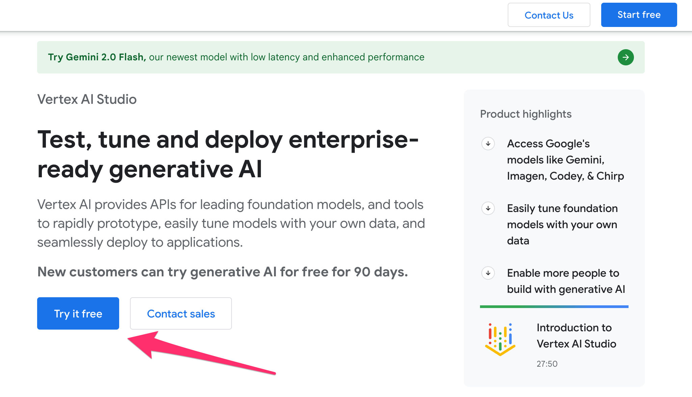
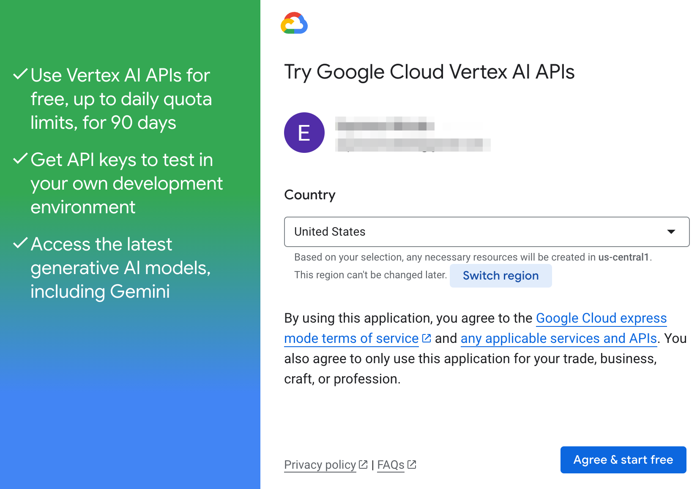
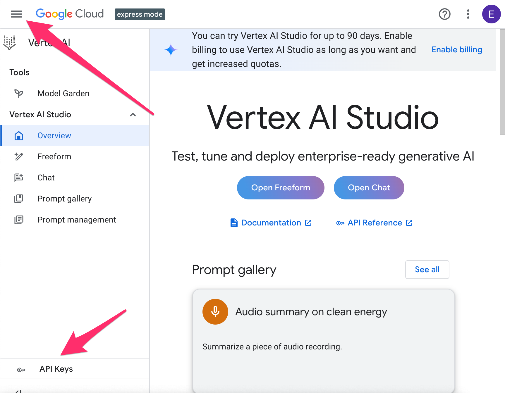
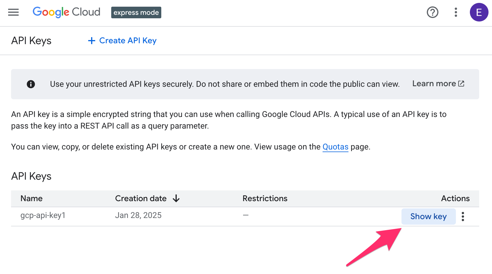

# Vertex AI Express Mode and LangChainJS

Vertex AI in Google Cloud offers a secure, robust, enterprise-scale,
platform for you do run AI operations in the cloud, including working
with Google's latest models such as Gemini and Imagen.
However, authentication can sometimes be a little tricky, involving
OAuth Service Accounts to keep the connections secure.

What if there was an easier way to access Gemini on the Google Cloud
Platform? This is now available with
Express Mode, where anyone who has a Gmail account can use Gemini
on GCP with just an API Key.

Oh, and did I mention that it is free for 90 days?

Let's take a look at how to access Express Mode and use it with
LangChainJS, a popular library to access a wide variety of LLMs. 
For more about getting started with LangChainJS and Gemini, see 
[this introductory post](https://code.iaflw.com/2024/06/langchainjs-and-gemini-getting-started.html).

## Who can use Express Mode?

Express Mode is intended for people who
* Have a Gmail login (NOT a login with Google Workspace) **AND**
* Have NOT used Google Cloud with that login.

If you don't have a Gmail login for this purpose, you can always create one.

## Why use Express Mode?

You may be wondering how Express Mode differs from AI Studio,
and why you might want to use one or the other.

The great news is that both make it easy to use Gemini with
just an API Key, and both have a free tier (that you can upgrade
to a paid tier later). But there are some differences.

For example with Express Mode:
* Accessing media files can be done using Google Drive or, with the
  paid tier, files from the web or public YouTube Video URLs.
* All your data will be resident in a specific data center, which
  may be important if you have data residency requirements.
* The free tier is only valid for 90 days.

With AI Studio:
* Accessing media files (such as images and videos) requires use of the
  AI Studio File API. 
* Google does not make any commitment which data center will be servicing
  your requests.
* The free tier never expires.

There may be other differences, including the rate limits that are in
place for each model or how pricing may vary, so you should check
the specifics for your own scenario.

## Getting started

To get started, you'll need to visit the information page on
[Vertex AI Studio](https://cloud.google.com/generative-ai-studio).

Make sure you're logged in - if you're not, or you don't have a
Gmail account, click the "Sign in" button in the upper right now.

Once you're logged in, select the "Try it free" button in the 
middle of the page.



If you don't see this button, you may already have used Google Cloud
with this account.

You'll be presented with another screen that asks you to confirm
the country you're in and accept the terms of service. This also
confirms what Google Cloud region you'll be using. Unless you have
a specific reason for it to be in another region, the default is
probably fine.



Once you accept the terms by selecting the button, it will
setup your environment, apply permissions, create an API Key for
you, and then open the Express Mode console page.

## The Express Mode console

A few quick notes about the console.

This is where you'll be able to access the Vertex AI Studio, where you can
try out Gemini using either prompts you create or some of the examples
in the Prompt Gallery. You'll be able to save your prompts and access
them later.

This is also where you can add billing if you want to add more features
to Gemini and continue using it for more than the 90 day free trial.

But mostly - this is where you'll go to get your API Key and to create
new keys if you want them.

## Getting your API Key

You can get your API Key, or create new ones, in one of two ways:
* Click on the three bar "hamburger" menu in the top left and select API Keys
* Click on the "API Keys" item in the lower left



Once on the page, you'll see a list of your available keys. To view
the key itself, click on "Show key". You can then copy it to use 
when writing your LangChainJS app.



(And if you ever want another key, or need to delete this one, you'll
be doing it from this page as well. Just "Create API Key" from the link
at the top, or use the three dot menu to delete the key.)

## Using LangChainJS

Once we have the key - how do we use it?

The latest versions of the
`@langchain/google-gauth` and `@langchain/google-webauth` packages
both support using the API Key from Express Mode. You have two options
to use them:
* Provide the key in the "GOOGLE_API_KEY" environment variable.
  LangChainJS will automatically detect it and use it.
* Specify it as an "apiKey" attribute you set when you create a
  `GoogleChat` object.

In either case, you also need to set the "platformType" 
attribute to indicate you're using the "gcp" platform.

In this example, we're setting the "apiKey" attribute in the
code, which isn't a good idea. If you omit these, LangChainJS
will attempt to read it from the "GOOGLE_API_KEY" environment
variable.

```typescript
import { ChatGoogle } from "@langchain/google-gauth";

const question = "What is the answer to life, the universe, and everything?";
const modelName = "gemini-2.0-flash-001";
const apiKey = "Your API Key Here";

const model = new ChatGoogle({
  modelName,
  apiKey,
  platformType: "gcp",
});

const result = await model.invoke(question);
console.log(result.content);
```

**Two Important Notes**:
* If you get the error 
  "API key not valid. Please pass a valid API Key" or
  "API keys are not supported by this API."
  then double-check what your API Key is set to. 
  For example, make sure there are no extra spaces
  and that you're using the key from Vertex AI Express Mode
  and NOT a key from AI Studio. If you're sure you're using a
  Vertex AI Express Mode key, then make sure that "platformType"
  is set to "gcp".
* Hard-coding the API Key in your source is **not a good idea**.
  Instead, using environment variables or reading your API Key
  from a secure source and setting the attribute are considered
  better practices.

If you're using node.js, it is common to store your environment
settings into a file named .env, and then make sure it isn't
checked into your version control system. With this, you might
have your .env file with a line such as

```text
GOOGLE_API_KEY=your_api_key_here
```

and then the code above is simplified:

```typescript
import { ChatGoogle } from "@langchain/google-gauth";

const question = "What is the answer to life, the universe, and everything?";
const modelName = "gemini-2.0-flash-001";

const model = new ChatGoogle({
  modelName,
  platformType: "gcp",
});

const result = await model.invoke(question);
console.log(result.content);
```

## Next steps

Express Mode is a great way to get started using Gemini on the 
Google Cloud Vertex AI platform. But when your needs grow larger
than the free tier supports, or your 90 days are up, what's next?

### Express Mode Paid Tier

First, you can always use the console to upgrade to a paid tier with 
Express Mode. This gives you access to higher rate limits and additional 
sources for media files. Nothing in your code will change in these cases.

### Full Vertex AI Version

If you find you want to use other services in Google Cloud, such as 
Google Cloud Storage or other models in the Vertex AI Model Garden,
it may be easiest to upgrade to the full version of Vertex AI. When
you do this, you'll switch to using a Service Account instead of the
API Key, but the only thing you need to change in your LangChainJS
code is to reference the Service Account credentials instead of
the API Key.

If you're using the .env file, this is straightforward.
You'll remove the entry for GOOGLE_API_KEY and add credential
information.

If you're using the `@langchain/google-gauth` library, this will
point to your certificate file:

```text
GOOGLE_APPLICATION_CREDENTIALS=/etc/credentials/project-name-123456-a213e257d2d9.json
```

While if you're using webauth, it needs to contain the contents of that 
file with something like this:

```text
GOOGLE_WEB_CREDENTIALS="{\"type\": \"service_account\" <lots of stuff omitted>"
```

### Switching to AI Studio API

If you're switching to the AI Studio API, you need to use a different
API Key (which we won't go over here), and then change the "platformType"
attribute to "gai" (for "Google AI"). Otherwise, the code might look
very similar:

```typescript
const model = new ChatGoogle({
  modelName,
  apiKey,
  platformType: "gai",
});
```

## Conclusion

Vertex AI Express Mode is a simple way to get started using Gemini on
the Google Cloud Vertex AI platform. It gives you a free way to get
started and use Gemini in a region of your choosing and with media
you've made available through Google Drive.

LangChainJS makes it easy to use Express Mode and, when you need to,
move to other platforms with minimal changes.

## Acknowledgements

Testing LangChainJS to support the changes required for Express Mode
were supported by Google Cloud Platform Credits provided by Google.

Special thanks to Linda Lawton, Denis V., Steven Gray, and Noble Ackerson
for their continued help, feedback, and friendship.
