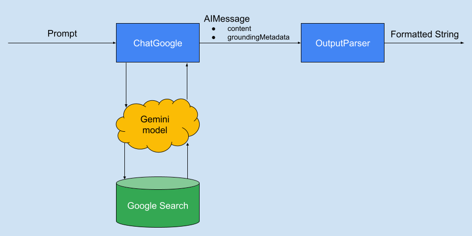

# Grounding Results with Google Search, Gemini, and LangChainJS

Have you ever used a Large Language Model (LLM) to help answer factual
questions, only to seem like it is making up, or hallucinating, the
results? Retrieval Augmented Generation (RAG) is a frequent solution
for this problem, and modern LLMs can use tool and function calling
with LangChainJS to make RAG solutions even easier.

Gemini takes this
several steps further by providing tools that are well integrated
into Gemini, and Gemini 2.0 improves this even more. One tool in
particular, Grounding with Google Search, helps you bring factual
and current information from Google Search into your results. It
even provides you references for the results!

We'll take a look at how Grounding with Google Search works, how
you can enable this tool in your calls to Gemini, the differences
between how it works in Gemini 1.5 and Gemini 2.0 (and how LangChainJS)
hides the differences between the two, and how you can easily format
the results using the Lang Chain Extension Language.

## The beginning... and the BIG problem.

As you may remember, Gemini can be accessed on two different
platforms, AI Studio and Vertex AI, with several different auth
methods involved. If you're not familiar with developing for
Gemini with LangChainJS, you should check out 
[LangChain.js and Gemini: Getting Started](https://code.iaflw.com/2024/06/langchainjs-and-gemini-getting-started.html).

For simplicity, we'll be using the `ChatGoogle`
class from the `google-gauth` package, but you can use one
that meets your need.

Our code to ask a question and print the results might look 
something like this:

```typescript
import { ChatGoogle } from "@langchain/google-gauth";

const question = "Who won the Nobel Prize in physics in 2024?"
const modelName = "gemini-1.5-flash-002";

const model = new ChatGoogle({
  modelName,
  temperature: 0,
});

const result = await model.invoke(question);
console.log(result.content);
```

Since Gemini 1.5 Flash has a knowledge cutoff date before the Nobel Prizes
were awarded in 2024, the answer might be something like this:

```text
I don't know, since the Nobel Prizes are usually awarded in October.
```

Not terribly useful, eh? What can we do about it?

## Getting answers with Google Search

If we had done a normal Google Search, or even used Google's Gemini chatbot,
to ask this question we'd have gotten the names of the recipients along 
with other information. But when calling the Gemini API, we will need
some other tools to help us ground our query.

Gemini 1.5 provides this using a tool named `googleSearchRetrieval`,
while Gemini 2.0 has a similar tool called `googleSearch`. While there
are some differences between the two, LangChainJS lets you use either,
no matter which model you choose.

We can import the tool to serve as a reference in typescript:
```typescript
import { GeminiTool } from "@langchain/google-common";
```

Then we'll configure the tool and create a model object that is aware
of the tool thusly:

```typescript
const searchTool: GeminiTool = {
  googleSearch: {},
};
const tools = [searchTool];
const model = new ChatGoogle({
  modelName,
  temperature: 0,
}).bindTools(tools);
```

With this, we can invoke the model with our question as we did in the previous section:

```typescript
const result = await model.invoke(question);
console.log(result.content);
```

and get a significantly different answer. Perhaps something like this:

```text
The 2024 Nobel Prize in Physics was awarded jointly to 
Geoffrey E. Hinton and John J. Hopfield.
```

One difference between this result and what you might get by doing a 
"traditional" Google Search on the website or on the Google app
is that we can follow links to help verify the information we get. Calling
the Gemini API this way doesn't give us access to this information.

Or does it?

## Cite your sources!

Gemini's Google Search Tool provides much of the same reference information
that we could have gotten through Google Search itself, although it is
in a slightly different form. LangChainJS provides this as part of
the `result` object that we get from invoking the model with our prompt,
specifically in the `response_metadata` object.

We can look at the `groundingMetadata` attribute with something like this: 

```typescript
const result = await model.invoke(question);
const grounding = result.response_metadata.groundingMetadata ?? {};
console.log(JSON.stringify(grounding, null, 2));
```

The `groundingMetadata` object contains several fields that can be
useful to us. These are all objects provided directly from Gemini,
and you can read the details at the documentation that I've linked to.

### `webSearchQueries` and `searchEntryPoint`
[documentation](https://ai.google.dev/api/generate-content#SearchEntryPoint)

Google 
[requires](https://ai.google.dev/gemini-api/docs/grounding/search-suggestions)
you to provide the search queries as links to a Google Search Results page.
To help you do this, it provides a list of the search queries that you
need to provide in `webSearchQueries`. It also provides some formatted
HTML which accomplishes this in `searchEntryPoint`.

### `groundingChunks`
[documentation](https://ai.google.dev/api/generate-content#GroundingChunk)

This is an array of
[`web`](https://ai.google.dev/api/generate-content#Web)
objects that contain a `title` and `uri`. These are references that were
used to ground the information. You can provide them as citations. The
`title` is usually the name of a domain, while the `uri` is a specialized
URL that redirects through Google to go to the site with the information
itself.

### `groundingSupports`
[documentation](https://ai.google.dev/api/generate-content#GroundingSupport)

This is an array of objects that contain three attributes in each
array element:

* `segment` - Which part of the content we're talking
about. This contains the start and end index into the string content.

* `groundingChunkIndicies` - An array of numeric indexes into the
`groundingChunks` array. This indicates which of those chunks were used
to create that output, or is a reference to that output.

* `confidenceScores` - Another array of numbers between 0 and 1 
indicating how likely the reference specified by the corresponding
`groundingChunkIndicies` element is relevant to the reply given.

You can use all this information to format the output so it provides
the reference information to the person using your application.

That seems like it might end up being complicated, however, doesn't it?
Is there a better way?

## Formatting the response and understanding the source

Fortunately, LangChainJS provides a way to take the output of a model
and transform it into a more suitable format. These are known as
[output parsers](https://js.langchain.com/docs/concepts/output_parsers/)
and work with the LangChain Extension Language (LCEL) as a core component
of the library.

We might visualize it as something like this:


The Google modules provide a `BaseGoogleSearchOutputParser` abstract
class which can take an AIMessage and, if there is `groundingMetadata`,
format it to include this metadata. We'll look at how to create your
own formatter in a moment, but there are some formatters already
provided to address a couple of common use cases.

The `SimpleGoogleSearchOutputParser` does some basic formatting and
is useful for examining the output from the search grounding. More
useful is probably the `MarkdownGoogleSearchOutputParser` can be
used to create output that looks very similar to how AI Studio formats
the output when search grounding is turned on.

When using these classes, we'll need to import the parser we want 
from the `google-common` package with something like this:

```typescript
import { SimpleGoogleSearchOutputParser } from "@langchain/google-common";
```

We then setup a chain where the model will pipe the output to this
output parser, and we'll invoke this chain. Since the output of this
chain will be a string, we can just display it. This part might look
something like this:

```typescript
const parser = new SimpleGoogleSearchOutputParser();
const chain = model.pipe(parser);

const result = await chain.invoke(question);
console.log(result);
```

This might give us output that looks something like this:

```text
Google Says:
The 2024 Nobel Prize in Physics was awarded jointly to John J. Hopfield 
and Geoffrey E. Hinton. [1, 2, 3, 4]  They were recognized for their 
foundational discoveries and inventions that enable machine learning with 
artificial neural networks. [1, 2, 4, 3]  Hinton's contributions included 
work on the Boltzmann machine, building upon the Hopfield network. [3]

1. aip.org - https://vertexaisearch.cloud.google.com/grounding-api-redirect/AUBnsYv92K2WO8rhfenrR_l8VlkUrXzm4saKwerbhp50YzLAfYZpOUVIknxhZgjQwLy2i1phmdH_zfWquaBFhfSwuMemcI9UvHls0UCuBraT7M0XWOrEl-yegUWO5lz8wS-WGb9NSpXyKJ2LEHa4IVqKZaur9I9pQxN1
2. youtube.com - https://vertexaisearch.cloud.google.com/grounding-api-redirect/AUBnsYtjy5nhKdekL8InSP-JiGxdvPYgbfcp27IgM96nAohukAkHqsY4pVJ4X4liElC7-dZyzDVWdyu-rsrRJWBXjB0gSChWaz2wTAMzbirTyxfYLbPiHL6lp_QaX8trlUD9V3a4Y92OYg==
3. utoronto.ca - https://vertexaisearch.cloud.google.com/grounding-api-redirect/AUBnsYufnzAWAqKJkUgLlseRJW_Q2paQlbO0siY0W9jtDtQ9XittUnt4yaK76wtBNv95qHXYA9NbtUl7akTnRwZsVU4UqR84XxOX1UGsnMfts1_lQpUHi_7eOKy5EtPEPoK07_fq8bY0OEQh9YaS_2SgPqRe8zLydqOr3xp38i8cvUTfmFlK-ZCfaWRmlVZI
4. nsf.gov - https://vertexaisearch.cloud.google.com/grounding-api-redirect/AUBnsYsc9tzlR82NAGHfI2wGz8GpTqnEyP5FXcnSkCYb2zWcj2GSbPq15disZJvYuu3yrxpi7IKFEeeELpaTN_EVwX4T6QxPPVxnyW7NaQ3XizRmZR3AZpLx1oidL57OEsTQJ3zFXJTQwvWnmnvMonkpF4PWYD116vL2101py-vGLaHAtCh9Fuj93_o=
```

While the `MarkdownGoogleSearchOutputParser` works similarly, just
with a slightly different format, and should work for most needs,
there may be cases where you want to modify either of these
or create a completely different formatter. Let's take a look at
how you can do this.

## Building your own formatter

Although LangChainJS provides some useful formatters with the 
`SimpleGoogleSearchOutputParser` and `MarkdownGoogleSearchOutputParser`, there
are certainly cases where it might make sense to either modify one of these
or to create your own.

The `BaseGoogleSearchOutputParser` is an abstract class that provides four
abstract methods that you would need to implement, plus one other that might
be useful to either use or modify.

### `textPrefix()` and `textSuffix()`

These two methods each take two parameters:
* `text` - a string with the body of the reply from the Model.
* `grounding` - the GroundingInfo which contains a `metadata` field with
  all the metadata specified above in the reply.

It is expected to either return a string or undefined. Undefined is treated
as if it was an empty string.

As the names suggest, you use this to specify a string that you wish to put
either before or after content from the model.

### `searchSuggestion()`

This method is already defined, is passed a GroundingInfo object, and
returns a string with the `renderedContent` field from the info. You
may wish to include this as part of your `textSuffix()` implementation.

### `segmentPrefix()` and `segmentSuffix()`

These methods are called for each `segment` that is available - the part of
the content that we're talking about in each element of the `groundingSupports`.
As the names suggest, these are called to insert text either just before
or just after the text in the segment.

They each take three parameters:
* `grounding` - the GroundingInfo, which contains the `metadata` for the entire response.
* `support` - The support information about this specific segment.
* `index` - Which segment index we're working with, starting with 0

### An example

With this, we can see how the `SimpleGoogleSearchOutputParser` works.
Our goal in this is to have a formatter that will put a numbered list
of references after the relevant text, and then have that list appear
at the bottom.

Our class is straightforward. It needs to extend from the
`BaseGoogleSearchOutputParser` and doesn't need a constructor, since
there are no other parameters to configure:

```typescript
export class SimpleGoogleSearchOutputParser extends BaseGoogleSearchOutputParser {
  // ...
}
```

There isn't anything we need to print before each text segment, so we can
have that function return undefined:

```typescript
  protected segmentPrefix(
        _grounding: GroundingInfo,
        _support: GeminiGroundingSupport,
        _index: number
): string | undefined {
  return undefined;
}
```

But after each segment, we want the link indices to be a comma-separated
list in square brackets. 
The index number is 0-based, but we want to start with "1"
since that is more human friendly:

```typescript
  protected segmentSuffix(
        _grounding: GroundingInfo,
        support: GeminiGroundingSupport,
        _index: number
): string | undefined {
  const indices: number[] = support.groundingChunkIndices.map((i) => i + 1);
  return ` [${indices.join(", ")}]`;
}
```

Before the entire block of text, we just want to print a simple message
about where the results come from:

```typescript
  protected textPrefix(_text: string, _grounding: GroundingInfo): string {
    return "Google Says:\n";
  }
```

And then after, we need to print that list of indexes (starting with 1).
To do this, we'll make a utility method that gets the information we need
(the title and URI) and formats it along with the index number. We can then
loop over all of the `groundingChunks` and add this formatted string
to the value returned:

```typescript
  protected chunkToString(chunk: GeminiGroundingChunk, index: number): string {
  const info = chunk.retrievedContext ?? chunk.web;
  return `${index + 1}. ${info.title} - ${info.uri}`;
}

protected textSuffix(_text: string, grounding: GroundingInfo): string {
  let ret = "\n";
  const chunks: GeminiGroundingChunk[] = grounding.metadata.groundingChunks;
  chunks.forEach((chunk, index) => {
    ret = `${ret}${this.chunkToString(chunk, index)}\n`;
  });
  return ret;
}
```

## Conclusions

We've seen that LLMs aren't reliable when it comes to answering questions,
but that grounding them can help. Grounding with Google Search becomes a
powerful tool that you can use that provides additional information about
where the results come from, letting people better understand the context
of the answers.

LangChainJS further enhances this, providing tools that you can use to 
format these results in ways that people would expect. These OutputParsers
are flexible and let you tailor the output to your needs.

I hope you enjoyed this article! I look forward to hearing about how
Grounding with Google Search and LangChainJS has helped you develop
better AI agents.

## Acknowledgements 

The development of LangChainJS support for Search Grounding in Gemini 2.0, 
the Output Parsers supporting it, and this documentation were all supported 
by Google Cloud Platform Credits provided by Google. 
My thanks to the teams at Google for their support.

Special thanks to Linda Lawton, Denis V., and Steven Gray for their help,
feedback, and friendship.
